# HR Analytics

# Business Problem

How much money is your business losing to high employee turnover?
 


Let us look at some statistics:
1. The average cost to replace an 8dollar/hour employee is about 5,500 dollars, not including benefits.
   2017 Stat: 11 billion dollar is lost annually due to employee turnover.
2. The average direct cost for a new employee (not including training) is 57,968 dollars.
   2017 Stat: Cost of replacing entry level employees: 30-50% of their annual salary.


Replacing a high-level employee can cost a lot to the company. COst include :
1. Cost of training a new person.
2. Loss of productivity, because a new person may take several months to years to reach the same productivity levels as the experience guy
3. Cost of hiring a new person.
4. Cost of off-boarding

These statistics don’t paint a pretty picture about the state of employee retention. The good news is that you can use these statistics as a way to develop new strategies to retain employees for the long haul, and hopefully develop a new hiring process along the way

# Objective 

1. To see what Factors contribute the most to the Employee turnover.
2. To analyse and come up with interesting patterns that tells something about employee turnover
3. To create a model that accurately classifies if an employee leaves the company or not
2. To come up with a business plan to the company which will help them to reduce the employee turnovers

# Obtaining the Data


```python
#Importing necessary packages to do data manipulation and Exploratory data analysis
import pandas as pd
import numpy as np
import matplotlib.pyplot as plt
import seaborn as sns
from statsmodels.graphics.mosaicplot import mosaic
%matplotlib inline
```


```python
df = pd.DataFrame.from_csv('HR_comma_sep.csv', index_col=None)
```

    C:\Users\amogh\Anaconda\lib\site-packages\ipykernel_launcher.py:1: FutureWarning: from_csv is deprecated. Please use read_csv(...) instead. Note that some of the default arguments are different, so please refer to the documentation for from_csv when changing your function calls
      """Entry point for launching an IPython kernel.
    

# Data Cleaning


```python
#Let us see how the data looks
df.head()
```


<div>
<style scoped>
    .dataframe tbody tr th:only-of-type {
        vertical-align: middle;
    }

    .dataframe tbody tr th {
        vertical-align: top;
    }

    .dataframe thead th {
        text-align: right;
    }
</style>
<table border="1" class="dataframe">
  <thead>
    <tr style="text-align: right;">
      <th></th>
      <th>satisfaction_level</th>
      <th>last_evaluation</th>
      <th>number_project</th>
      <th>average_montly_hours</th>
      <th>time_spend_company</th>
      <th>Work_accident</th>
      <th>left</th>
      <th>promotion_last_5years</th>
      <th>Department</th>
      <th>salary</th>
    </tr>
  </thead>
  <tbody>
    <tr>
      <th>0</th>
      <td>0.38</td>
      <td>0.53</td>
      <td>2</td>
      <td>157</td>
      <td>3</td>
      <td>0</td>
      <td>1</td>
      <td>0</td>
      <td>sales</td>
      <td>low</td>
    </tr>
    <tr>
      <th>1</th>
      <td>0.80</td>
      <td>0.86</td>
      <td>5</td>
      <td>262</td>
      <td>6</td>
      <td>0</td>
      <td>1</td>
      <td>0</td>
      <td>sales</td>
      <td>medium</td>
    </tr>
    <tr>
      <th>2</th>
      <td>0.11</td>
      <td>0.88</td>
      <td>7</td>
      <td>272</td>
      <td>4</td>
      <td>0</td>
      <td>1</td>
      <td>0</td>
      <td>sales</td>
      <td>medium</td>
    </tr>
    <tr>
      <th>3</th>
      <td>0.72</td>
      <td>0.87</td>
      <td>5</td>
      <td>223</td>
      <td>5</td>
      <td>0</td>
      <td>1</td>
      <td>0</td>
      <td>sales</td>
      <td>low</td>
    </tr>
    <tr>
      <th>4</th>
      <td>0.37</td>
      <td>0.52</td>
      <td>2</td>
      <td>159</td>
      <td>3</td>
      <td>0</td>
      <td>1</td>
      <td>0</td>
      <td>sales</td>
      <td>low</td>
    </tr>
  </tbody>
</table>
</div>


Let us see if there are any missing values in the Data set


```python
df.isnull().sum()
```


    satisfaction_level       0
    last_evaluation          0
    number_project           0
    average_montly_hours     0
    time_spend_company       0
    Work_accident            0
    left                     0
    promotion_last_5years    0
    Department               0
    salary                   0
    dtype: int64


There are no missing data here, this is a very clean data set.

# EDA

Hypothesis Generation

Before we begin to explore the data, it is very important to putforth Couple of hypothesis which we think might hold true based on the domain knowledge.

Hypothesis Generation is the process of listing out all the possible factors that can affect the outcome.

Hypothesis generation is done before having a look at the data in order to avoid any bias that may result after the observation.

Hypothesis generation helps us to point out the factors which might affect our dependent variable. Below are some of the hypotheses which I think can affect Employee Tunrover Rate in the HR Analytics Project:

a.satisfaction_level   
Satisfaction is very key at the company for any employee. Our hypothesis is lower the Satisfaction rate, higher the rate of turnover

b.number_project
The number of projects play a vital role in an Employeer's turnover. The Employee is highly likely to churn if he is on a single project or if he has been alotted to different projects till now.

c.promotion_last_5years : no promotion or not promoted much in the last 5 years, may make the employee assume the employer is not showing enough interest/ not giving the recognition the employee should be able to get. Lower the promotion level in the last 5 years, higher the chances of employee leaving the company

d.salary: Salary is crucial in the industry. If an employee feels his salary levels are low and not as per the expectations, he might leave the company for better opportunities outside.
 
e.Work_accident : A work accident is very troublesome to an employee. It may be from his side or from the copmany towards him. Both are likely to result in a churn.

f.last_evaluation: if the last evaluation was not so good for an employee, it implies he might have not got a good hike/ expected salary. This plays a vital role. Lower evaluation is a good indicator of employee churn

Let us start exploring our data based on these hypothesis in our mind and see if we can find any interesting patterns


```python
df.shape
```


    (14999, 10)


The data has 14999 entries and 10 variables


```python
df.info()
```

    <class 'pandas.core.frame.DataFrame'>
    RangeIndex: 14999 entries, 0 to 14998
    Data columns (total 10 columns):
    satisfaction_level       14999 non-null float64
    last_evaluation          14999 non-null float64
    number_project           14999 non-null int64
    average_montly_hours     14999 non-null int64
    time_spend_company       14999 non-null int64
    Work_accident            14999 non-null int64
    left                     14999 non-null int64
    promotion_last_5years    14999 non-null int64
    Department               14999 non-null object
    salary                   14999 non-null object
    dtypes: float64(2), int64(6), object(2)
    memory usage: 1.1+ MB
    

The variable left is misclassified as integer, let us convert to onject


```python
df['left'] = df['left'].astype(str)
```


```python
df.info()
```

    <class 'pandas.core.frame.DataFrame'>
    RangeIndex: 14999 entries, 0 to 14998
    Data columns (total 10 columns):
    satisfaction_level       14999 non-null float64
    last_evaluation          14999 non-null float64
    number_project           14999 non-null int64
    average_montly_hours     14999 non-null int64
    time_spend_company       14999 non-null int64
    Work_accident            14999 non-null int64
    left                     14999 non-null object
    promotion_last_5years    14999 non-null int64
    Department               14999 non-null object
    salary                   14999 non-null object
    dtypes: float64(2), int64(5), object(3)
    memory usage: 1.1+ MB
    

As we see 'left' is the target variable which we are intrested in. There are 2 categorical variables and 7 numerical variables


Let us get a overview of how our data looks


```python
#numerical columns
df.describe(include = np.number)
```


<div>
<style scoped>
    .dataframe tbody tr th:only-of-type {
        vertical-align: middle;
    }

    .dataframe tbody tr th {
        vertical-align: top;
    }

    .dataframe thead th {
        text-align: right;
    }
</style>
<table border="1" class="dataframe">
  <thead>
    <tr style="text-align: right;">
      <th></th>
      <th>satisfaction_level</th>
      <th>last_evaluation</th>
      <th>number_project</th>
      <th>average_montly_hours</th>
      <th>time_spend_company</th>
      <th>Work_accident</th>
      <th>promotion_last_5years</th>
    </tr>
  </thead>
  <tbody>
    <tr>
      <th>count</th>
      <td>14999.000000</td>
      <td>14999.000000</td>
      <td>14999.000000</td>
      <td>14999.000000</td>
      <td>14999.000000</td>
      <td>14999.000000</td>
      <td>14999.000000</td>
    </tr>
    <tr>
      <th>mean</th>
      <td>0.612834</td>
      <td>0.716102</td>
      <td>3.803054</td>
      <td>201.050337</td>
      <td>3.498233</td>
      <td>0.144610</td>
      <td>0.021268</td>
    </tr>
    <tr>
      <th>std</th>
      <td>0.248631</td>
      <td>0.171169</td>
      <td>1.232592</td>
      <td>49.943099</td>
      <td>1.460136</td>
      <td>0.351719</td>
      <td>0.144281</td>
    </tr>
    <tr>
      <th>min</th>
      <td>0.090000</td>
      <td>0.360000</td>
      <td>2.000000</td>
      <td>96.000000</td>
      <td>2.000000</td>
      <td>0.000000</td>
      <td>0.000000</td>
    </tr>
    <tr>
      <th>25%</th>
      <td>0.440000</td>
      <td>0.560000</td>
      <td>3.000000</td>
      <td>156.000000</td>
      <td>3.000000</td>
      <td>0.000000</td>
      <td>0.000000</td>
    </tr>
    <tr>
      <th>50%</th>
      <td>0.640000</td>
      <td>0.720000</td>
      <td>4.000000</td>
      <td>200.000000</td>
      <td>3.000000</td>
      <td>0.000000</td>
      <td>0.000000</td>
    </tr>
    <tr>
      <th>75%</th>
      <td>0.820000</td>
      <td>0.870000</td>
      <td>5.000000</td>
      <td>245.000000</td>
      <td>4.000000</td>
      <td>0.000000</td>
      <td>0.000000</td>
    </tr>
    <tr>
      <th>max</th>
      <td>1.000000</td>
      <td>1.000000</td>
      <td>7.000000</td>
      <td>310.000000</td>
      <td>10.000000</td>
      <td>1.000000</td>
      <td>1.000000</td>
    </tr>
  </tbody>
</table>
</div>


```python
#categorical columns
df.describe(include = np.object)
```


<div>
<style scoped>
    .dataframe tbody tr th:only-of-type {
        vertical-align: middle;
    }

    .dataframe tbody tr th {
        vertical-align: top;
    }

    .dataframe thead th {
        text-align: right;
    }
</style>
<table border="1" class="dataframe">
  <thead>
    <tr style="text-align: right;">
      <th></th>
      <th>left</th>
      <th>Department</th>
      <th>salary</th>
    </tr>
  </thead>
  <tbody>
    <tr>
      <th>count</th>
      <td>14999</td>
      <td>14999</td>
      <td>14999</td>
    </tr>
    <tr>
      <th>unique</th>
      <td>2</td>
      <td>10</td>
      <td>3</td>
    </tr>
    <tr>
      <th>top</th>
      <td>0</td>
      <td>sales</td>
      <td>low</td>
    </tr>
    <tr>
      <th>freq</th>
      <td>11428</td>
      <td>4140</td>
      <td>7316</td>
    </tr>
  </tbody>
</table>
</div>


let us see how our target variables looks like and its distribution


```python
df['left'].value_counts()
```


    0    11428
    1     3571
    Name: left, dtype: int64


We see in the dataset, the ratio of left to not left is almost 1:3


```python
df.groupby('left').mean()
```


<div>
<style scoped>
    .dataframe tbody tr th:only-of-type {
        vertical-align: middle;
    }

    .dataframe tbody tr th {
        vertical-align: top;
    }

    .dataframe thead th {
        text-align: right;
    }
</style>
<table border="1" class="dataframe">
  <thead>
    <tr style="text-align: right;">
      <th></th>
      <th>satisfaction_level</th>
      <th>last_evaluation</th>
      <th>number_project</th>
      <th>average_montly_hours</th>
      <th>time_spend_company</th>
      <th>Work_accident</th>
      <th>promotion_last_5years</th>
    </tr>
    <tr>
      <th>left</th>
      <th></th>
      <th></th>
      <th></th>
      <th></th>
      <th></th>
      <th></th>
      <th></th>
    </tr>
  </thead>
  <tbody>
    <tr>
      <th>0</th>
      <td>0.666810</td>
      <td>0.715473</td>
      <td>3.786664</td>
      <td>199.060203</td>
      <td>3.380032</td>
      <td>0.175009</td>
      <td>0.026251</td>
    </tr>
    <tr>
      <th>1</th>
      <td>0.440098</td>
      <td>0.718113</td>
      <td>3.855503</td>
      <td>207.419210</td>
      <td>3.876505</td>
      <td>0.047326</td>
      <td>0.005321</td>
    </tr>
  </tbody>
</table>
</div>


we can get a rough idea like maybe low promotion in 5 years and low satisfaction level has made employees leave the company when compared with those who have not left the company


```python
df.info()
```

    <class 'pandas.core.frame.DataFrame'>
    RangeIndex: 14999 entries, 0 to 14998
    Data columns (total 10 columns):
    satisfaction_level       14999 non-null float64
    last_evaluation          14999 non-null float64
    number_project           14999 non-null int64
    average_montly_hours     14999 non-null int64
    time_spend_company       14999 non-null int64
    Work_accident            14999 non-null int64
    left                     14999 non-null object
    promotion_last_5years    14999 non-null int64
    Department               14999 non-null object
    salary                   14999 non-null object
    dtypes: float64(2), int64(5), object(3)
    memory usage: 1.1+ MB
    


```python
numeric =[]
categorical = []
for columns in df.columns.drop(['left']):
#     print (np.issubdtype(df[columns].dtype, np.number))
    if (df[columns].dtype == 'object'):
        categorical.append(columns)
        
    else:
        numeric.append(columns)
```


```python
print(numeric)
print(categorical)
```

    ['satisfaction_level', 'last_evaluation', 'number_project', 'average_montly_hours', 'time_spend_company', 'Work_accident', 'promotion_last_5years']
    ['Department', 'salary']
    

Now that we have seperated the numerical and categorical features, let us proceed with the univariate analysis of the variables


```python
f = pd.melt(df, value_vars=numeric)
```


```python
g = sns.FacetGrid(f, col="variable",  col_wrap=5, sharex=False, sharey=False)
g = g.map(sns.distplot, "value")
```

    C:\Users\amogh\Anaconda\lib\site-packages\matplotlib\axes\_axes.py:6462: UserWarning: The 'normed' kwarg is deprecated, and has been replaced by the 'density' kwarg.
      warnings.warn("The 'normed' kwarg is deprecated, and has been "
    C:\Users\amogh\Anaconda\lib\site-packages\matplotlib\axes\_axes.py:6462: UserWarning: The 'normed' kwarg is deprecated, and has been replaced by the 'density' kwarg.
      warnings.warn("The 'normed' kwarg is deprecated, and has been "
    C:\Users\amogh\Anaconda\lib\site-packages\matplotlib\axes\_axes.py:6462: UserWarning: The 'normed' kwarg is deprecated, and has been replaced by the 'density' kwarg.
      warnings.warn("The 'normed' kwarg is deprecated, and has been "
    C:\Users\amogh\Anaconda\lib\site-packages\matplotlib\axes\_axes.py:6462: UserWarning: The 'normed' kwarg is deprecated, and has been replaced by the 'density' kwarg.
      warnings.warn("The 'normed' kwarg is deprecated, and has been "
    C:\Users\amogh\Anaconda\lib\site-packages\matplotlib\axes\_axes.py:6462: UserWarning: The 'normed' kwarg is deprecated, and has been replaced by the 'density' kwarg.
      warnings.warn("The 'normed' kwarg is deprecated, and has been "
    C:\Users\amogh\Anaconda\lib\site-packages\matplotlib\axes\_axes.py:6462: UserWarning: The 'normed' kwarg is deprecated, and has been replaced by the 'density' kwarg.
      warnings.warn("The 'normed' kwarg is deprecated, and has been "
    C:\Users\amogh\Anaconda\lib\site-packages\matplotlib\axes\_axes.py:6462: UserWarning: The 'normed' kwarg is deprecated, and has been replaced by the 'density' kwarg.
      warnings.warn("The 'normed' kwarg is deprecated, and has been "
    


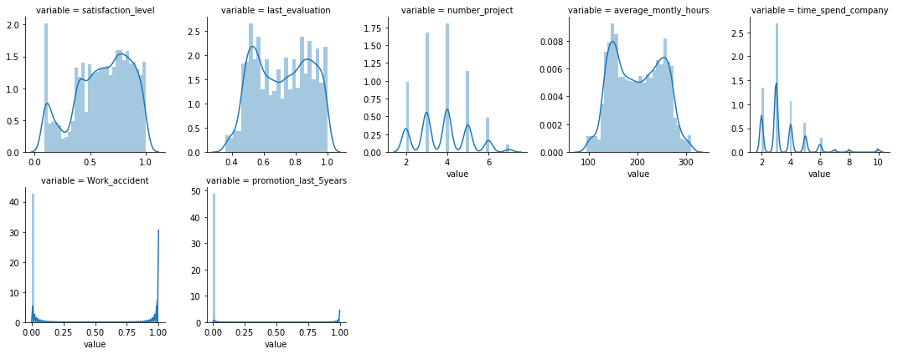


```python
df[numeric].describe()
```


<div>
<style scoped>
    .dataframe tbody tr th:only-of-type {
        vertical-align: middle;
    }

    .dataframe tbody tr th {
        vertical-align: top;
    }

    .dataframe thead th {
        text-align: right;
    }
</style>
<table border="1" class="dataframe">
  <thead>
    <tr style="text-align: right;">
      <th></th>
      <th>satisfaction_level</th>
      <th>last_evaluation</th>
      <th>number_project</th>
      <th>average_montly_hours</th>
      <th>time_spend_company</th>
      <th>Work_accident</th>
      <th>promotion_last_5years</th>
    </tr>
  </thead>
  <tbody>
    <tr>
      <th>count</th>
      <td>14999.000000</td>
      <td>14999.000000</td>
      <td>14999.000000</td>
      <td>14999.000000</td>
      <td>14999.000000</td>
      <td>14999.000000</td>
      <td>14999.000000</td>
    </tr>
    <tr>
      <th>mean</th>
      <td>0.612834</td>
      <td>0.716102</td>
      <td>3.803054</td>
      <td>201.050337</td>
      <td>3.498233</td>
      <td>0.144610</td>
      <td>0.021268</td>
    </tr>
    <tr>
      <th>std</th>
      <td>0.248631</td>
      <td>0.171169</td>
      <td>1.232592</td>
      <td>49.943099</td>
      <td>1.460136</td>
      <td>0.351719</td>
      <td>0.144281</td>
    </tr>
    <tr>
      <th>min</th>
      <td>0.090000</td>
      <td>0.360000</td>
      <td>2.000000</td>
      <td>96.000000</td>
      <td>2.000000</td>
      <td>0.000000</td>
      <td>0.000000</td>
    </tr>
    <tr>
      <th>25%</th>
      <td>0.440000</td>
      <td>0.560000</td>
      <td>3.000000</td>
      <td>156.000000</td>
      <td>3.000000</td>
      <td>0.000000</td>
      <td>0.000000</td>
    </tr>
    <tr>
      <th>50%</th>
      <td>0.640000</td>
      <td>0.720000</td>
      <td>4.000000</td>
      <td>200.000000</td>
      <td>3.000000</td>
      <td>0.000000</td>
      <td>0.000000</td>
    </tr>
    <tr>
      <th>75%</th>
      <td>0.820000</td>
      <td>0.870000</td>
      <td>5.000000</td>
      <td>245.000000</td>
      <td>4.000000</td>
      <td>0.000000</td>
      <td>0.000000</td>
    </tr>
    <tr>
      <th>max</th>
      <td>1.000000</td>
      <td>1.000000</td>
      <td>7.000000</td>
      <td>310.000000</td>
      <td>10.000000</td>
      <td>1.000000</td>
      <td>1.000000</td>
    </tr>
  </tbody>
</table>
</div>


```python
#Generic function for the plots
def plot_feature(df, col):
    plt.figure(figsize=(16,4))
    plt.subplot(1,2,1)
    if df[col].dtype != 'object':
        df[col].value_counts().sort_index().plot()
        plt.xlabel(col)
        plt.ylabel('counts')
        plt.subplot(1,2,2)
        sns.boxplot(x='left',y=col,data=df)
        
    
    else:
        sns.countplot(col,data = df)
        plt.xticks(rotation=-45)        
        mosaic(df, [col,'left'],gap=0.01, label_rotation=-45)
        
    
```


```python
plot_feature(df,'satisfaction_level')
```


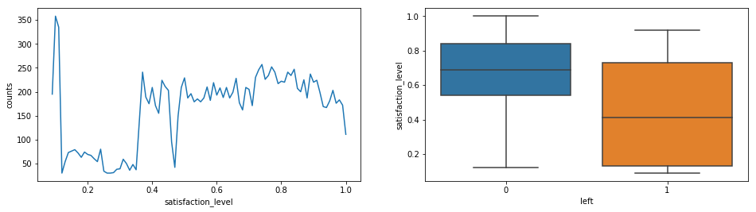


It is evident from the plot that lower the satisfaction, higher the probability of an employee leaving the company. This is in sync with our first hypothesis


```python
plot_feature(df,'number_project')
```


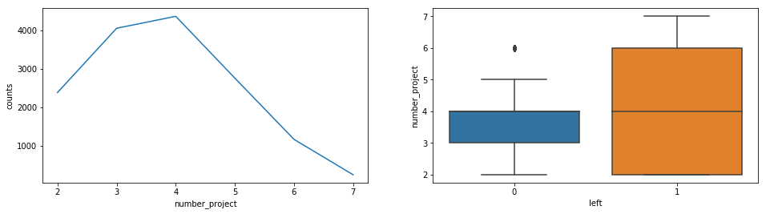


People with 3-4 projects are most likely to not leave the company. People with fewer number of projects or those who have done large number of projects till now are likely to change the company.

Our third hypothesis is about promotion since last 5 years, let us see how it compares with the employee tunrover.
Also the variable is misclassified as integer but it is a categorical variable of 0/1. Let us convert it to categorical variable


```python
df['promotion_last_5years'] = df['promotion_last_5years'].astype(str)
```


```python
plot_feature(df,'promotion_last_5years')
```


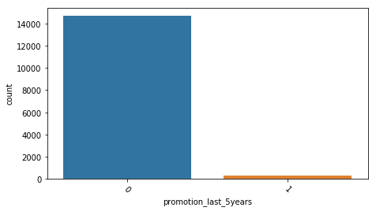


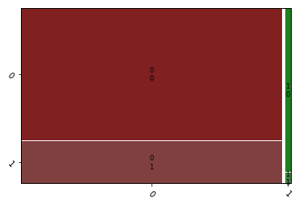


```python
df['promotion_last_5years'].value_counts()
```


    0    14680
    1      319
    Name: promotion_last_5years, dtype: int64


We see that only 319 out of 15000 have got promoted in the last 5 years, which is less that 2.5% of the strength of the company. This may well be a strong reason for an employee to leave the company.
The factors which contribute to the employee promotion may be several, but promoting less employees that too this is for 5 years, is very harmful to the company


```python
plot_feature(df,'salary')
```


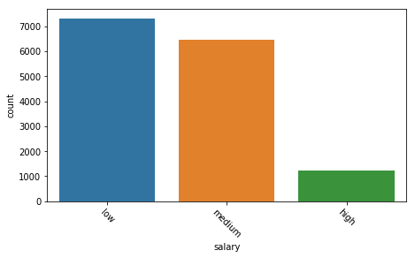


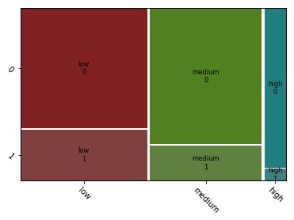


Though this does not tell us indepth about the salary, it is evident that the employees with low salary have a higher rate of leaving the company, which is quite obvious in every company.


```python
df['Work_accident'].value_counts()
```


    0    12830
    1     2169
    Name: Work_accident, dtype: int64


```python
plot_feature(df,'Work_accident')
```


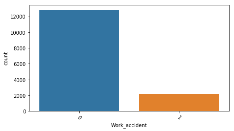


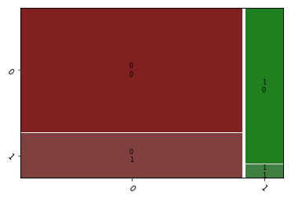


A work accident does not really have any effect on the employees leaving the company. Here those with no work accidents have higher ratio of leaving the company


```python
plot_feature(df,'last_evaluation')
```


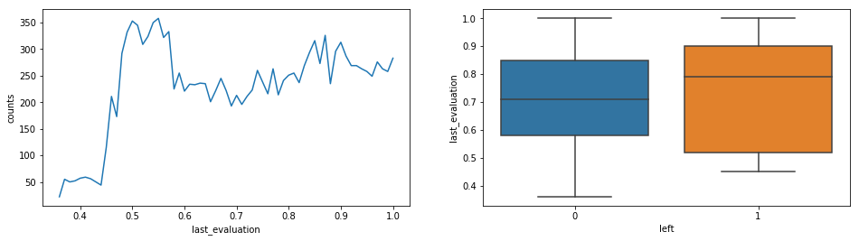


Employees who got 0.5-0.6 in their last evaluation are higher in number compared to other rating counts. But as we see from the graph, the mdeian for those who left the company has higher rating than those who have lower rating. SO low performance rating does not really have any direct impact on the employees leaving the company


```python
plot_feature(df,'average_montly_hours')
```


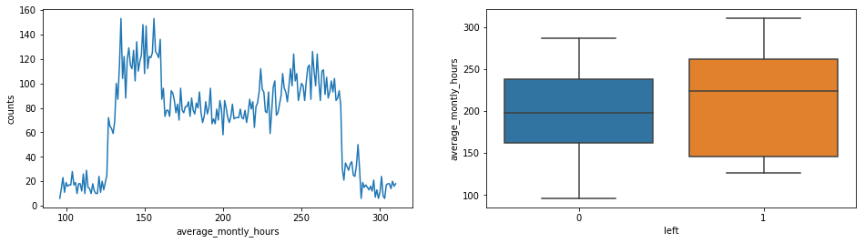


People who spend very large amount of time in the company may tend to leave the company. Though this is not a clear indication


```python
plot_feature(df,'time_spend_company')
```


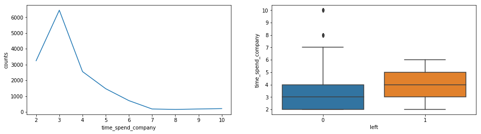


People who have spent 2-3 years in a company are less likely to leave the company when company when compared to those who have spent on an average 4 years at the company


```python
plot_feature(df,'Department')
```


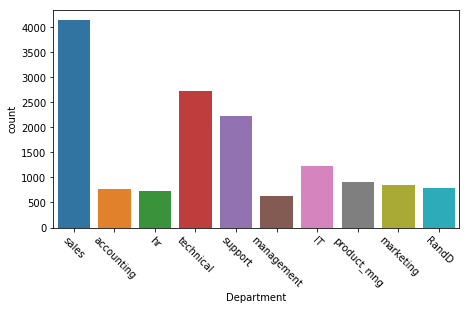


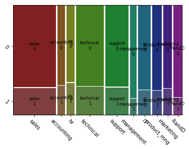


```python
df['Department'].value_counts()
```


    sales          4140
    technical      2720
    support        2229
    IT             1227
    product_mng     902
    marketing       858
    RandD           787
    accounting      767
    hr              739
    management      630
    Name: Department, dtype: int64


```python
dept_unique= df['Department'].unique()
```

Since the graph is not so clear, let us see which department has the highest proportion of employees leaving the company.


```python
for item in dept_unique:
    left = round(df[df['Department'].values == item]['left'].value_counts()[1] / len(df[df['Department'].values == item]['left']),3)
    print (left , item)
```

    0.245 sales
    0.266 accounting
    0.291 hr
    0.256 technical
    0.249 support
    0.144 management
    0.222 IT
    0.22 product_mng
    0.237 marketing
    0.154 RandD
    

We see that Hr has the highest employee turnover rate, followed by accounting and technical departments

# Satisfaction VS Evaluation

- here are 3 distinct clusters for employees who left the company
- Cluster 1 (Hard-working and Sad Employee): Satisfaction was below 0.2 and evaluations were greater than 0.75. Which could be a good indication that employees who left the company were good workers but felt horrible at their job.

- Question: What could be the reason for feeling so horrible when you are highly evaluated? Could it be working too hard? Could this cluster mean employees who are "overworked"?
- Cluster 2 (Bad and Sad Employee): Satisfaction between about 0.35~0.45 and evaluations below ~0.58. This could be seen as employees who were badly evaluated and felt bad at work.

- Question: Could this cluster mean employees who "under-performed"?
- Cluster 3 (Hard-working and Happy Employee): Satisfaction between 0.7~1.0 and evaluations were greater than 0.8. Which could mean that employees in this cluster were "ideal". They loved their work and were evaluated highly for their performance.

- Question: Could this cluser mean that employees left because they found another job opportunity?


```python
sns.lmplot(x='satisfaction_level', y='last_evaluation', data=df,
           fit_reg=False, # No regression line
           hue='left')   # Color by evolution stage
```


    <seaborn.axisgrid.FacetGrid at 0x1c7788b2400>


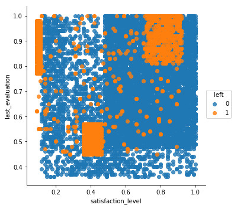


# Correlation Matrix


```python
df.columns
```


    Index(['satisfaction_level', 'last_evaluation', 'number_project',
           'average_montly_hours', 'time_spend_company', 'Work_accident', 'left',
           'promotion_last_5years', 'Department', 'salary'],
          dtype='object')


```python
# Create a correlation matrix. What features correlate the most with turnover? What other correlations did you find?
corr = df.corr()
corr = (corr)
sns.heatmap(corr, 
            xticklabels=corr.columns.values,
            yticklabels=corr.columns.values)
plt.title('Heatmap of Correlation Matrix')
corr
```


<div>
<style scoped>
    .dataframe tbody tr th:only-of-type {
        vertical-align: middle;
    }

    .dataframe tbody tr th {
        vertical-align: top;
    }

    .dataframe thead th {
        text-align: right;
    }
</style>
<table border="1" class="dataframe">
  <thead>
    <tr style="text-align: right;">
      <th></th>
      <th>satisfaction_level</th>
      <th>last_evaluation</th>
      <th>number_project</th>
      <th>average_montly_hours</th>
      <th>time_spend_company</th>
    </tr>
  </thead>
  <tbody>
    <tr>
      <th>satisfaction_level</th>
      <td>1.000000</td>
      <td>0.105021</td>
      <td>-0.142970</td>
      <td>-0.020048</td>
      <td>-0.100866</td>
    </tr>
    <tr>
      <th>last_evaluation</th>
      <td>0.105021</td>
      <td>1.000000</td>
      <td>0.349333</td>
      <td>0.339742</td>
      <td>0.131591</td>
    </tr>
    <tr>
      <th>number_project</th>
      <td>-0.142970</td>
      <td>0.349333</td>
      <td>1.000000</td>
      <td>0.417211</td>
      <td>0.196786</td>
    </tr>
    <tr>
      <th>average_montly_hours</th>
      <td>-0.020048</td>
      <td>0.339742</td>
      <td>0.417211</td>
      <td>1.000000</td>
      <td>0.127755</td>
    </tr>
    <tr>
      <th>time_spend_company</th>
      <td>-0.100866</td>
      <td>0.131591</td>
      <td>0.196786</td>
      <td>0.127755</td>
      <td>1.000000</td>
    </tr>
  </tbody>
</table>
</div>


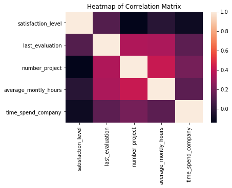


# PreProcessing

let us first seperate the numerical and the categorical variables and then convert the categorical features to numbers format which will be understood by the model better


```python
df.info()
```

    <class 'pandas.core.frame.DataFrame'>
    RangeIndex: 14999 entries, 0 to 14998
    Data columns (total 10 columns):
    satisfaction_level       14999 non-null float64
    last_evaluation          14999 non-null float64
    number_project           14999 non-null int64
    average_montly_hours     14999 non-null int64
    time_spend_company       14999 non-null int64
    Work_accident            14999 non-null int64
    left                     14999 non-null object
    promotion_last_5years    14999 non-null object
    Department               14999 non-null object
    salary                   14999 non-null object
    dtypes: float64(2), int64(4), object(4)
    memory usage: 1.1+ MB
    


```python
numerical = []
categorical = []
for column in df.columns:
    if df[column].dtype == 'object':
        categorical.append(column)
    else:
        numerical.append(column)
```


```python
print("Numerical Features= ",numerical)
print("Categorical features  = ",categorical)
```

    Numerical Features=  ['satisfaction_level', 'last_evaluation', 'number_project', 'average_montly_hours', 'time_spend_company', 'Work_accident']
    Categorical features  =  ['left', 'promotion_last_5years', 'Department', 'salary']
    


```python
#COnverting the categorical features to dummies
categ_df = pd.get_dummies(df[categorical], drop_first= True)
numer_df = df[numerical]
new_df = pd.concat([categ_df,numer_df], axis= 1 )
```


```python
new_df.shape
```


    (14999, 19)


```python
new_df.columns
```


    Index(['left_1', 'promotion_last_5years_1', 'Department_RandD',
           'Department_accounting', 'Department_hr', 'Department_management',
           'Department_marketing', 'Department_product_mng', 'Department_sales',
           'Department_support', 'Department_technical', 'salary_low',
           'salary_medium', 'satisfaction_level', 'last_evaluation',
           'number_project', 'average_montly_hours', 'time_spend_company',
           'Work_accident'],
          dtype='object')


We see the total columns is now 18 and that all the categorical features have been converted to numerical features, this will make the data more clearer to the models.

# How to Treat Imbalanced Datasets

There are many ways of dealing with imbalanced data. We will focus in the following approaches:

- Oversampling — SMOTE
- Undersampling — RandomUnderSampler

# Split Train/Test Set

Let's split our data into a train and test set. We'll fit our model with the train set and leave our test set for our last evaluation.


```python

from sklearn.model_selection import train_test_split
from sklearn.metrics import accuracy_score, classification_report, precision_score, recall_score, confusion_matrix, precision_recall_curve

# Create the X and y set
X = new_df.iloc[:,1:]
y = new_df.iloc[:,0]

# Define train and test
X_train, X_test, y_train, y_test = train_test_split(X,y,test_size=0.20, random_state=123, stratify=y)
```

# Resample Methods

Let's train a base logistic regression model on the two types of samples to see which yields the best result:

- Orginal Sample
- Upsampling Data


# Upsampling using SMOTE

Let's train a base logistic regression model on the the sample using SMOTE and compare to our base sample to see the performance


more about SMOTE : http://rikunert.com/SMOTE_explained


```python
from sklearn.utils import resample
from imblearn.over_sampling import SMOTE 

# Upsample using SMOTE
sm = SMOTE(random_state=12, ratio = 1.0)
x_train_sm, y_train_sm = sm.fit_sample(X_train, y_train)


print("Original shape:", X_train.shape, y_train.shape)
print ("SMOTE sample shape:", x_train_sm.shape, y_train_sm.shape)

```

    Original shape: (11999, 18) (11999,)
    SMOTE sample shape: (18284, 18) (18284,)
    

Apply 10-Fold Cross Validation for Logistic Regression

# SMOTE
You use the nearest neighbors of the minority observations to create new synthetic data


```python
from sklearn.linear_model import LogisticRegression
from sklearn.pipeline import make_pipeline
from sklearn.preprocessing import StandardScaler
from sklearn.model_selection import cross_val_score

# Create the Original, Upsampled, and Downsampled training sets
methods_data = {"Original": (X_train, y_train),
                "SMOTE":(x_train_sm, y_train_sm)}

# Loop through each type of training sets and apply 5-Fold CV using Logistic Regression
# By default in cross_val_score StratifiedCV is used
for method in methods_data.keys():
    lr_results = cross_val_score(LogisticRegression(), methods_data[method][0], methods_data[method][1], cv=5, scoring='f1')
    print(f"The best F1 Score for {method} data:")
    print (lr_results.mean())
 
cross_val_score(LogisticRegression(class_weight='balanced'), X_train, y_train, cv=5, scoring='f1').mean()
```

    C:\Users\amogh\Anaconda\lib\site-packages\sklearn\linear_model\logistic.py:432: FutureWarning: Default solver will be changed to 'lbfgs' in 0.22. Specify a solver to silence this warning.
      FutureWarning)
    C:\Users\amogh\Anaconda\lib\site-packages\sklearn\linear_model\logistic.py:432: FutureWarning: Default solver will be changed to 'lbfgs' in 0.22. Specify a solver to silence this warning.
      FutureWarning)
    C:\Users\amogh\Anaconda\lib\site-packages\sklearn\linear_model\logistic.py:432: FutureWarning: Default solver will be changed to 'lbfgs' in 0.22. Specify a solver to silence this warning.
      FutureWarning)
    C:\Users\amogh\Anaconda\lib\site-packages\sklearn\linear_model\logistic.py:432: FutureWarning: Default solver will be changed to 'lbfgs' in 0.22. Specify a solver to silence this warning.
      FutureWarning)
    C:\Users\amogh\Anaconda\lib\site-packages\sklearn\linear_model\logistic.py:432: FutureWarning: Default solver will be changed to 'lbfgs' in 0.22. Specify a solver to silence this warning.
      FutureWarning)
    C:\Users\amogh\Anaconda\lib\site-packages\sklearn\linear_model\logistic.py:432: FutureWarning: Default solver will be changed to 'lbfgs' in 0.22. Specify a solver to silence this warning.
      FutureWarning)
    C:\Users\amogh\Anaconda\lib\site-packages\sklearn\linear_model\logistic.py:432: FutureWarning: Default solver will be changed to 'lbfgs' in 0.22. Specify a solver to silence this warning.
      FutureWarning)
    

    The best F1 Score for Original data:
    0.4496346788932494
    

    C:\Users\amogh\Anaconda\lib\site-packages\sklearn\linear_model\logistic.py:432: FutureWarning: Default solver will be changed to 'lbfgs' in 0.22. Specify a solver to silence this warning.
      FutureWarning)
    C:\Users\amogh\Anaconda\lib\site-packages\sklearn\linear_model\logistic.py:432: FutureWarning: Default solver will be changed to 'lbfgs' in 0.22. Specify a solver to silence this warning.
      FutureWarning)
    C:\Users\amogh\Anaconda\lib\site-packages\sklearn\linear_model\logistic.py:432: FutureWarning: Default solver will be changed to 'lbfgs' in 0.22. Specify a solver to silence this warning.
      FutureWarning)
    C:\Users\amogh\Anaconda\lib\site-packages\sklearn\linear_model\logistic.py:432: FutureWarning: Default solver will be changed to 'lbfgs' in 0.22. Specify a solver to silence this warning.
      FutureWarning)
    C:\Users\amogh\Anaconda\lib\site-packages\sklearn\linear_model\logistic.py:432: FutureWarning: Default solver will be changed to 'lbfgs' in 0.22. Specify a solver to silence this warning.
      FutureWarning)
    

    The best F1 Score for SMOTE data:
    0.7880562801129458
    

    C:\Users\amogh\Anaconda\lib\site-packages\sklearn\linear_model\logistic.py:432: FutureWarning: Default solver will be changed to 'lbfgs' in 0.22. Specify a solver to silence this warning.
      FutureWarning)
    C:\Users\amogh\Anaconda\lib\site-packages\sklearn\linear_model\logistic.py:432: FutureWarning: Default solver will be changed to 'lbfgs' in 0.22. Specify a solver to silence this warning.
      FutureWarning)
    C:\Users\amogh\Anaconda\lib\site-packages\sklearn\linear_model\logistic.py:432: FutureWarning: Default solver will be changed to 'lbfgs' in 0.22. Specify a solver to silence this warning.
      FutureWarning)
    


    0.6091127190611549


# Modeling

Splitting the data into training and test data


```python
from sklearn import model_selection
from sklearn.model_selection import KFold, cross_val_score, cross_validate, train_test_split
from sklearn import feature_selection
from sklearn.metrics import roc_auc_score
from sklearn.metrics import classification_report
from sklearn.metrics import accuracy_score
from sklearn.linear_model import LogisticRegression
from sklearn.ensemble import RandomForestClassifier
from sklearn import tree
from sklearn.tree import DecisionTreeClassifier
from sklearn.linear_model import LogisticRegression
from sklearn.ensemble import ExtraTreesClassifier
from sklearn.ensemble import BaggingClassifier
from sklearn.ensemble import AdaBoostClassifier
from sklearn.ensemble import GradientBoostingClassifier
from sklearn.ensemble import VotingClassifier
from sklearn.gaussian_process import GaussianProcessClassifier
from sklearn.linear_model import LogisticRegressionCV
from sklearn.naive_bayes import BernoulliNB
from sklearn.neighbors import KNeighborsClassifier
from sklearn.svm import SVC
from xgboost import XGBClassifier
from sklearn.ensemble import VotingClassifier
```

# Logistic Regression


```python
from sklearn.metrics import roc_auc_score
from sklearn.metrics import accuracy_score

lr = LogisticRegression()

# Fit the model to the Upsampling data
lr = lr.fit(x_train_sm, y_train_sm)

print ("\n\n ---Logistic Regression Model---")
lr_auc = roc_auc_score(y_test, lr.predict(X_test))

print ("Logistic Regression AUC = %2.2f" % lr_auc)

lr2 = lr.fit(x_train_sm, y_train_sm)
print(classification_report(y_test, lr.predict(X_test)))
```

    C:\Users\amogh\Anaconda\lib\site-packages\sklearn\linear_model\logistic.py:432: FutureWarning: Default solver will be changed to 'lbfgs' in 0.22. Specify a solver to silence this warning.
      FutureWarning)
    C:\Users\amogh\Anaconda\lib\site-packages\sklearn\linear_model\logistic.py:432: FutureWarning: Default solver will be changed to 'lbfgs' in 0.22. Specify a solver to silence this warning.
      FutureWarning)
    

    
    
     ---Logistic Regression Model---
    Logistic Regression AUC = 0.78
                  precision    recall  f1-score   support
    
               0       0.93      0.75      0.83      2286
               1       0.51      0.81      0.62       714
    
       micro avg       0.77      0.77      0.77      3000
       macro avg       0.72      0.78      0.73      3000
    weighted avg       0.83      0.77      0.78      3000
    
    

# Decision Tree


```python
# dt = DecisionTreeClassifier()
# dt.fit(X_train,Y_train)
# print ("Decision Tree accuracy is %2.2f" % accuracy_score(Y_test, dt.predict(X_test)))

# from sklearn.ensemble import  DecisionTreeClassifier

# Random Forest Model
dt = DecisionTreeClassifier()

dt_result = cross_val_score(dt, x_train_sm, y_train_sm, cv=5, scoring='f1')

dt_result.mean()
```


    0.980967412408479


```python
from sklearn.metrics import roc_auc_score

dt = dt.fit(x_train_sm, y_train_sm)

print ("\n\n ---Random Forest Model---")
dt_roc_auc = roc_auc_score(y_test, dt.predict(X_test))
print ("Random Forest AUC = %2.2f" % dt_roc_auc)
print(classification_report(y_test, dt.predict(X_test)))
```

    
    
     ---Random Forest Model---
    Random Forest AUC = 0.98
                  precision    recall  f1-score   support
    
               0       0.99      0.98      0.99      2286
               1       0.94      0.98      0.96       714
    
       micro avg       0.98      0.98      0.98      3000
       macro avg       0.97      0.98      0.97      3000
    weighted avg       0.98      0.98      0.98      3000
    
    

# Random Forest

Apply 5-Fold Cross Validation for Random Forest


```python
from sklearn.ensemble import RandomForestClassifier

# Random Forest Model
rf = RandomForestClassifier(n_estimators=50)

rf_result = cross_val_score(rf, x_train_sm, y_train_sm, cv=5, scoring='f1')

rf_result.mean()

```


    0.9898401299953807


```python
from sklearn.metrics import roc_auc_score

rf = rf.fit(x_train_sm, y_train_sm)

print ("\n\n ---Random Forest Model---")
rf_roc_auc = roc_auc_score(y_test, rf.predict(X_test))
print ("Random Forest AUC = %2.2f" % rf_roc_auc)
print(classification_report(y_test, rf.predict(X_test)))
```

    
    
     ---Random Forest Model---
    Random Forest AUC = 0.99
                  precision    recall  f1-score   support
    
               0       0.99      0.99      0.99      2286
               1       0.98      0.98      0.98       714
    
       micro avg       0.99      0.99      0.99      3000
       macro avg       0.99      0.99      0.99      3000
    weighted avg       0.99      0.99      0.99      3000
    
    

# XGB Classifier


```python
from sklearn.ensemble import GradientBoostingClassifier
```


```python
gbc = GradientBoostingClassifier()  

gbc = gbc.fit(x_train_sm,y_train_sm)

gbc
```


    GradientBoostingClassifier(criterion='friedman_mse', init=None,
                  learning_rate=0.1, loss='deviance', max_depth=3,
                  max_features=None, max_leaf_nodes=None,
                  min_impurity_decrease=0.0, min_impurity_split=None,
                  min_samples_leaf=1, min_samples_split=2,
                  min_weight_fraction_leaf=0.0, n_estimators=100,
                  n_iter_no_change=None, presort='auto', random_state=None,
                  subsample=1.0, tol=0.0001, validation_fraction=0.1,
                  verbose=0, warm_start=False)


Apply 5-Fold Cross Validation for Gradient Boosting


```python
gbc_result = cross_val_score(gbc, x_train_sm, y_train_sm, cv=5, scoring='f1')
gbc_result.mean()
```


    0.9695902047111046


```python

from sklearn.metrics import roc_auc_score

print ("\n\n ---Gradient Boosting Model---")
gbc_auc = roc_auc_score(y_test, gbc.predict(X_test))
print ("Gradient Boosting Classifier AUC = %2.2f" % gbc_auc)
print(classification_report(y_test, gbc.predict(X_test)))
```

    
    
     ---Gradient Boosting Model---
    Gradient Boosting Classifier AUC = 0.96
                  precision    recall  f1-score   support
    
               0       0.98      0.98      0.98      2286
               1       0.93      0.93      0.93       714
    
       micro avg       0.97      0.97      0.97      3000
       macro avg       0.96      0.96      0.96      3000
    weighted avg       0.97      0.97      0.97      3000
    
    

# Support Vector Classifier


```python
from sklearn.svm import SVC 

svclassifier = SVC(kernel='rbf', probability=True)  

svclassifier.fit(x_train_sm,y_train_sm)

```

    C:\Users\amogh\Anaconda\lib\site-packages\sklearn\svm\base.py:196: FutureWarning: The default value of gamma will change from 'auto' to 'scale' in version 0.22 to account better for unscaled features. Set gamma explicitly to 'auto' or 'scale' to avoid this warning.
      "avoid this warning.", FutureWarning)
    


    SVC(C=1.0, cache_size=200, class_weight=None, coef0=0.0,
      decision_function_shape='ovr', degree=3, gamma='auto_deprecated',
      kernel='rbf', max_iter=-1, probability=True, random_state=None,
      shrinking=True, tol=0.001, verbose=False)


Apply 5-Fold Cross Validation for SVC


```python
svc_result = cross_val_score(svclassifier, x_train_sm, y_train_sm, cv=5, scoring='f1')
svc_result.mean()
```

    C:\Users\amogh\Anaconda\lib\site-packages\sklearn\svm\base.py:196: FutureWarning: The default value of gamma will change from 'auto' to 'scale' in version 0.22 to account better for unscaled features. Set gamma explicitly to 'auto' or 'scale' to avoid this warning.
      "avoid this warning.", FutureWarning)
    C:\Users\amogh\Anaconda\lib\site-packages\sklearn\svm\base.py:196: FutureWarning: The default value of gamma will change from 'auto' to 'scale' in version 0.22 to account better for unscaled features. Set gamma explicitly to 'auto' or 'scale' to avoid this warning.
      "avoid this warning.", FutureWarning)
    C:\Users\amogh\Anaconda\lib\site-packages\sklearn\svm\base.py:196: FutureWarning: The default value of gamma will change from 'auto' to 'scale' in version 0.22 to account better for unscaled features. Set gamma explicitly to 'auto' or 'scale' to avoid this warning.
      "avoid this warning.", FutureWarning)
    C:\Users\amogh\Anaconda\lib\site-packages\sklearn\svm\base.py:196: FutureWarning: The default value of gamma will change from 'auto' to 'scale' in version 0.22 to account better for unscaled features. Set gamma explicitly to 'auto' or 'scale' to avoid this warning.
      "avoid this warning.", FutureWarning)
    C:\Users\amogh\Anaconda\lib\site-packages\sklearn\svm\base.py:196: FutureWarning: The default value of gamma will change from 'auto' to 'scale' in version 0.22 to account better for unscaled features. Set gamma explicitly to 'auto' or 'scale' to avoid this warning.
      "avoid this warning.", FutureWarning)
    


    0.9506357170054198


```python

from sklearn.metrics import roc_auc_score

print ("\n\n ---Support Vector Classifier Model---")
svc_auc = roc_auc_score(y_test, svclassifier.predict(X_test))
print ("Support Vector Classifierr AUC = %2.2f" % svc_auc)
print(classification_report(y_test, svclassifier.predict(X_test)))
```

    
    
     ---Support Vector Classifier Model---
    Support Vector Classifierr AUC = 0.94
                  precision    recall  f1-score   support
    
               0       0.98      0.94      0.96      2286
               1       0.83      0.94      0.88       714
    
       micro avg       0.94      0.94      0.94      3000
       macro avg       0.91      0.94      0.92      3000
    weighted avg       0.94      0.94      0.94      3000
    
    

# ROC Graph


```python
# Create ROC Graph
from sklearn.metrics import roc_curve
fpr, tpr, thresholds = roc_curve(y_test, lr.predict_proba(X_test)[:,1])
rf_fpr, rf_tpr, rf_thresholds = roc_curve(y_test, rf.predict_proba(X_test)[:,1])
gbc_fpr, gbc_tpr, gbc_thresholds = roc_curve(y_test, gbc.predict_proba(X_test)[:,1])
svc_fpr, svc_tpr, svc_thresholds = roc_curve(y_test, svclassifier.predict_proba(X_test)[:,1])


plt.figure()

# Plot Logistic Regression ROC
plt.plot(fpr, tpr, label='Logistic Regression (area = %0.2f)' % lr_auc)

# Plot Random Forest ROC
plt.plot(rf_fpr, rf_tpr, label='Random Forest Classifier (area = %0.2f)' % rf_roc_auc)

# Plot Decision Tree ROC
plt.plot(gbc_fpr, gbc_tpr, label='Gradient Boosting Classifier (area = %0.2f)' % gbc_auc)

# Plot SVC ROC
plt.plot(svc_fpr, svc_tpr, label='Gradient Boosting Classifier (area = %0.2f)' % svc_auc)

# Plot Base Rate ROC
plt.plot([0,1], [0,1],label='Base Rate')

plt.xlim([0.0, 1.0])
plt.ylim([0.0, 1.05])
plt.xlabel('False Positive Rate')
plt.ylabel('True Positive Rate')
plt.title('ROC Graph')
plt.legend(loc="lower right")
plt.show()
```


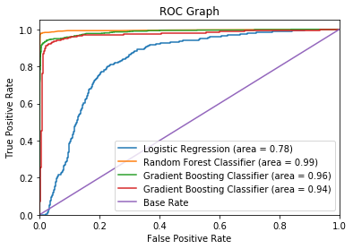


```python
#Let us build a confusion matrix for Random forest Moddel
from sklearn.metrics import confusion_matrix
confusion_matrix(y_test, rf.predict(X_test))
```


    array([[2271,   15],
           [  15,  699]], dtype=int64)


```python
y_test.value_counts()
```


    0    2286
    1     714
    Name: left_1, dtype: int64


Our Model is identifying good number of True positives and True Negatives. It has 26 false negatives and 3 false positives


```python
#serializing our model to a file called model.pkl
import pickle

pickle.dump(rf, open("model.pkl","wb"))
```


```python
#loading a model from a file called model.pkl
model_rf = pickle.load(open("model.pkl","rb"))
```


```python
#LEt us check if the model was loaded properly
confusion_matrix(y_test, model_rf.predict(X_test))
```


    array([[2271,   15],
           [  15,  699]], dtype=int64)


We are getting the same confusion matrix we got like the previous case, so our model was dumped and loaded properly


# Random Forest Feature Importance


```python

# Get Feature Importances
feature_importances = pd.DataFrame(rf.feature_importances_,
                                   index = X_train.columns,
                                    columns=['importance']).sort_values('importance', ascending=False)
feature_importances = feature_importances.reset_index()
feature_importances
```


<div>
<style scoped>
    .dataframe tbody tr th:only-of-type {
        vertical-align: middle;
    }

    .dataframe tbody tr th {
        vertical-align: top;
    }

    .dataframe thead th {
        text-align: right;
    }
</style>
<table border="1" class="dataframe">
  <thead>
    <tr style="text-align: right;">
      <th></th>
      <th>index</th>
      <th>importance</th>
    </tr>
  </thead>
  <tbody>
    <tr>
      <th>0</th>
      <td>satisfaction_level</td>
      <td>0.239749</td>
    </tr>
    <tr>
      <th>1</th>
      <td>time_spend_company</td>
      <td>0.215007</td>
    </tr>
    <tr>
      <th>2</th>
      <td>number_project</td>
      <td>0.192433</td>
    </tr>
    <tr>
      <th>3</th>
      <td>average_montly_hours</td>
      <td>0.155078</td>
    </tr>
    <tr>
      <th>4</th>
      <td>last_evaluation</td>
      <td>0.125427</td>
    </tr>
    <tr>
      <th>5</th>
      <td>Work_accident</td>
      <td>0.025132</td>
    </tr>
    <tr>
      <th>6</th>
      <td>salary_low</td>
      <td>0.011826</td>
    </tr>
    <tr>
      <th>7</th>
      <td>Department_sales</td>
      <td>0.006170</td>
    </tr>
    <tr>
      <th>8</th>
      <td>Department_technical</td>
      <td>0.005984</td>
    </tr>
    <tr>
      <th>9</th>
      <td>salary_medium</td>
      <td>0.005562</td>
    </tr>
    <tr>
      <th>10</th>
      <td>Department_support</td>
      <td>0.004190</td>
    </tr>
    <tr>
      <th>11</th>
      <td>Department_hr</td>
      <td>0.003069</td>
    </tr>
    <tr>
      <th>12</th>
      <td>Department_RandD</td>
      <td>0.002512</td>
    </tr>
    <tr>
      <th>13</th>
      <td>Department_accounting</td>
      <td>0.002044</td>
    </tr>
    <tr>
      <th>14</th>
      <td>promotion_last_5years_1</td>
      <td>0.002024</td>
    </tr>
    <tr>
      <th>15</th>
      <td>Department_management</td>
      <td>0.001854</td>
    </tr>
    <tr>
      <th>16</th>
      <td>Department_marketing</td>
      <td>0.000983</td>
    </tr>
    <tr>
      <th>17</th>
      <td>Department_product_mng</td>
      <td>0.000955</td>
    </tr>
  </tbody>
</table>
</div>


```python

sns.set(style="whitegrid")

# Initialize the matplotlib figure
f, ax = plt.subplots(figsize=(13, 7))

# Plot the Feature Importance
sns.set_color_codes("pastel")
sns.barplot(x="importance", y='index', data=feature_importances,
            label="Total", color="b")
```


    <matplotlib.axes._subplots.AxesSubplot at 0x1c778b82a58>


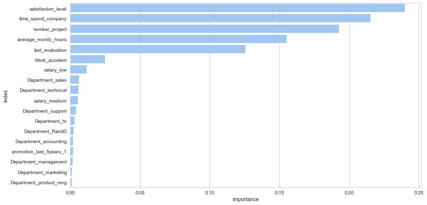


```python
rf.predict_proba(X_test)
```


    array([[1.  , 0.  ],
           [0.56, 0.44],
           [0.96, 0.04],
           ...,
           [0.98, 0.02],
           [0.94, 0.06],
           [0.02, 0.98]])


# Conclusion

- Based on the probability of an employee leaving the company, the company should take time to discuss with an employee how he is feeling at the company and take measures to retain them. Some of them can be like giving incentives, bonus , good hike, satisfying project depending on their needs if it is possible. 
- We can also give training to employees so as to increase their knowledge capacities and make them confident in the company.
- We also saw that from the feature importance that satisfaction is a major contributor to the employee turnover at the company. The company should primarily make sure that the companies policies are geared towards satisfying the people and keeping them happy under stressful circumstances. The company can take their employees like twice a year to an outing or team lunch which will make them very happy.
- The company should make sure it promotes more number of employees every year because only 300 out of the 15000 were promoted in the last 5 years, which averages to 60 per year, which is way too less
- The company should make sure that the employees have ideal number of projects and are not bombarded with multiple projects or are they left jobless to keep them going
- Special care should be given to those who have spent more than 4 years at the company, because they are more likely to leave the company and are very expensive to replace. 
